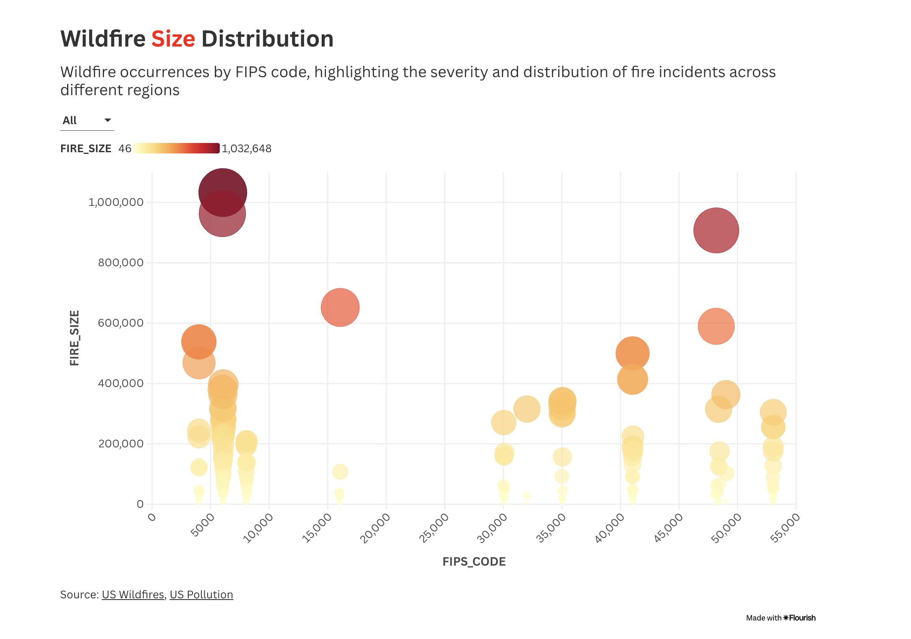
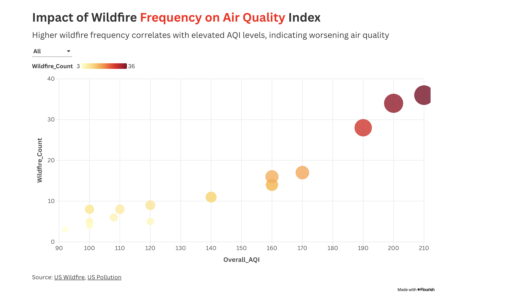
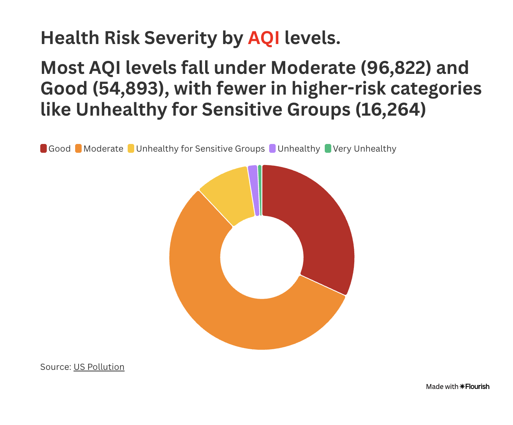
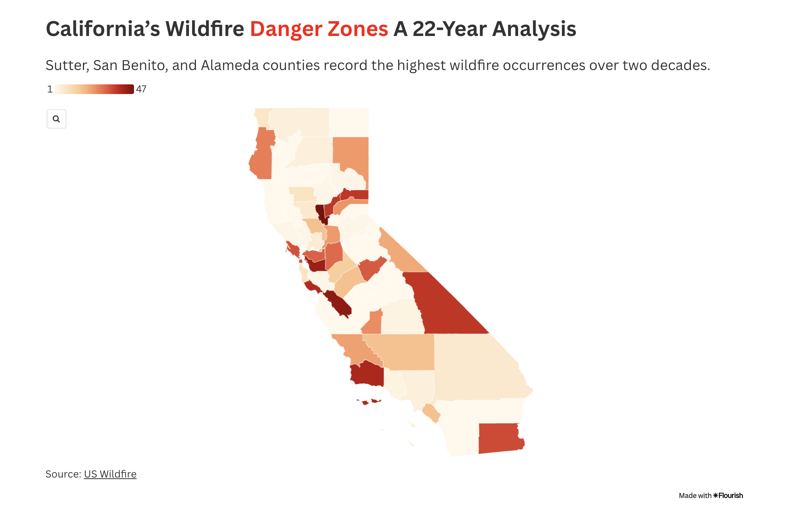

# 🔥 BlazeToxicity: Impact of U.S. Wildfires on Air Quality and Public Health

## 🧠 Abstract

Wildfires in the United States have surged in both frequency and severity over the past two decades due to climate change, land-use changes, and human activities. These events emit vast quantities of particulate matter (PM2.5, PM10) and toxic gases (CO, NO₂, O₃), significantly degrading air quality and exacerbating respiratory and cardiovascular health conditions. 

This project investigates the long-term environmental and public health implications of wildfire activity across the U.S. from 2000 to 2022. Through the integration of two large-scale datasets — wildfire incidents and air quality measurements — we identify temporal spikes, regional danger zones, and statistically significant correlations between wildfire frequency and AQI deterioration. Visualized using Flourish Studio, our findings offer actionable insights for public health planning and environmental policy.

---

## 💻 Technologies Used

- **Python (Pandas, GeoPandas, Matplotlib)** – Data processing, aggregation, and analysis  
- **Flourish Studio** – Interactive visualizations and dashboard design  
- **Jupyter Notebooks** – Exploratory Data Analysis (EDA)  
- **Google Sites** – Final project web hosting and presentation  

---

## 📂 Data Sources

- **[U.S. Pollution Dataset (2000–2022)](https://www.kaggle.com/datasets/guslovesmath/us-pollution-data-200-to-2022)** 
  Contains air quality measurements (PM2.5, PM10, CO, NO₂, O₃) from government monitoring stations.

- **[188 Million U.S. Wildfires Dataset](https://www.kaggle.com/datasets/rtatman/188-million-us-wildfires/data)**  
  Records wildfire events across the U.S. with detailed metadata such as year, size, cause, and FIPS location codes.

---

## 🚀 Project Features

- 📈 **Wildfire Trends Visualization**: Tracks total acres burned and fire frequency from 2002–2020  
- 🗺️ **Danger Zone Mapping**: Visualizes California counties with highest wildfire occurrence  
- 🔬 **AQI Analysis**: Highlights correlation between wildfire events and poor air quality  
- 📊 **Health Risk Classification**: Categorizes AQI levels into Good, Moderate, and Unhealthy  
- 🔗 **Interactive Dashboards**: All charts and maps created in Flourish for live exploration  

---

## 🖼️ Project Overview (Screenshots of Visualizations)

### 🔥 Wildfire Trends Over Time  
Tracks increase in fire frequency and acres burned over time  

---

### 🧯 Wildfire Size Distribution by Region  
Bubble plot of fire size grouped by FIPS code  

---

### 💨 Impact of Wildfire Frequency on AQI  
Correlation between number of fires and average air quality  

---

### 📊 Health Risk Breakdown by AQI  
Donut chart showing AQI category distribution  

---

### 🗺️ California’s Wildfire Danger Zones  
Choropleth map of fire incidents across counties  

---

## 🔗 Interactive Dashboards

All visualizations are also accessible as live dashboards on Flourish:

- [Wildfire Trends](https://public.flourish.studio/visualisation/22250630/)  
- [Size Distribution](https://public.flourish.studio/visualisation/22255179/)  
- [AQI Impact](https://public.flourish.studio/visualisation/22251796/)  
- [Health Risk by AQI](https://public.flourish.studio/visualisation/22251557/)  
- [California Map](https://public.flourish.studio/visualisation/22255159/)

---

## 🌐 Live Website

Explore the full case study and dashboard on our hosted project site:  
🔗 [BlazeToxicity on Google Sites](https://sites.google.com/view/blazetoxicity/home)
